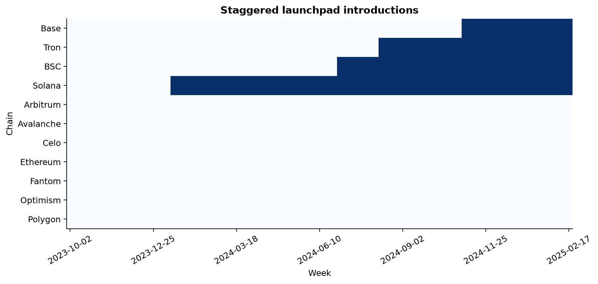
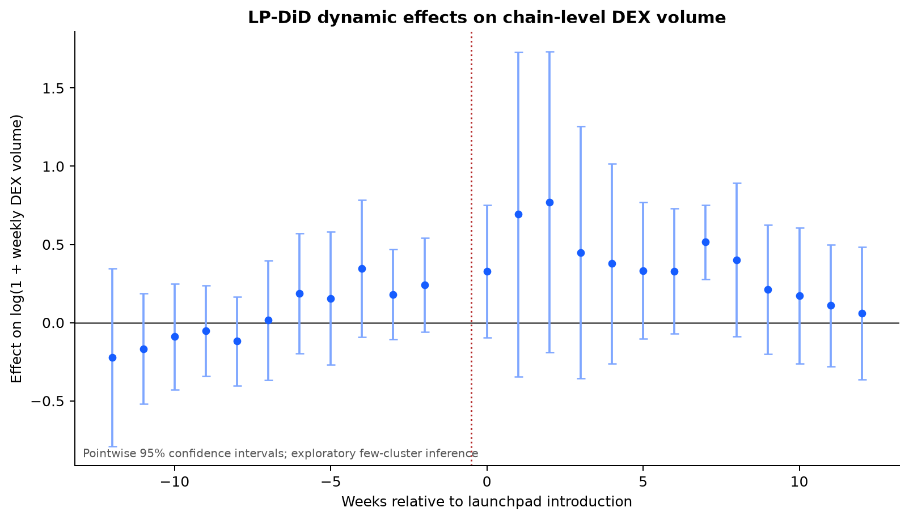
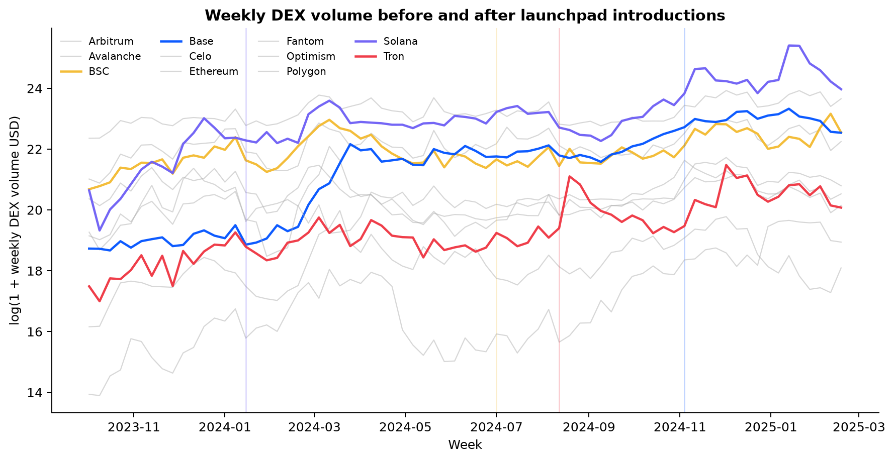

# Token Launchpad Causal Inference MVP

## Conclusion and research question

RQ: Does the launch of a high availability permissionless token launchpad increase weekly DEX trading volume on its host chain?

The implementation is complete and reproducible. It contains a balanced weekly panel, a Local Projections Difference in Differences model, an event study figure, machine readable results, provenance records, cached raw data, and automated tests.

The result is exploratory. The pooled mean dynamic difference from event week 0 through week 12 is 44.1 percent, but this conceals substantial cohort heterogeneity. The corresponding cohort summaries are 73.8 percent for Solana, 3.7 percent for BSC, 145.2 percent for Tron, and minus 3.0 percent for Base. None of the eleven pointwise pre period coefficients is significant at 5 percent. This does not prove parallel trends. The evidence supports continued investigation, not a common launchpad treatment effect.

Reproduction clarification: all statistics and figures are generated by one version locked Python pipeline from cached, checksummed public API responses; rerunning without a data refresh reproduces the current analysis offline.

## Data

### Provenance

Daily chain level spot DEX volume comes from the [DefiLlama DEX API and dashboard](https://defillama.com/dexs/chains). The metric is daily spot DEX trading volume denominated in USD.

The source was retrieved on 2026-07-26 UTC. Every response is preserved with its request parameters, retrieval timestamp, observation count, and SHA256 checksum. Daily observations are summed into Monday based calendar weeks.

The balanced analysis panel covers 2023-10-02 through 2025-02-23. It contains 11 chains, 73 weeks per chain, and 803 chain week observations. Every included chain week contains seven observed source days.

### Treatment events

| Host chain | Launchpad | Launch date | Date evidence |
|:--|:--|:--|:--|
| Solana | Pump.fun | 2024-01-19 | [Official launch month](https://pump.fun/pump-token), with the exact day from a [secondary launch history](https://en.wikipedia.org/wiki/Pump.fun) |
| BSC | Four.meme | 2024-07-03 | [Dated launch release](https://www.accessnewswire.com/newsroom/en/blockchain-and-cryptocurrency/four.meme-a-fair-launch-platform-for-memes-on-bnb-chain-launches-t-882514) |
| Tron | SunPump | 2024-08-12 | [Official SUN.io announcement](https://sunio.zendesk.com/hc/en-us/articles/36265413580953-Announcement-on-the-Launch-of-SunPump-on-SUN-io) |
| Base | Clanker | 2024-11-08 | [Earliest dated deployment on the official site](https://clanker.world/) |

The seven never treated controls are Ethereum, Arbitrum, Optimism, Polygon, Avalanche, Fantom, and Celo. Never treated here means that the selected treatment definition is absent during the analysis window. It does not imply that a chain had no other token creation platform or market shock.

## Method

The estimator is Local Projections Difference in Differences, or LP DiD, proposed by Dube, Girardi, Jordà, and Taylor in [A Local Projections Approach to Difference in Differences](https://doi.org/10.1002/jae.70000).

For a treated chain launching at week \(t\), each post treatment horizon \(h\) compares:

\[
\left(Y_{\text{treated},t+h}-Y_{\text{treated},t-1}\right)
-
\left(Y_{\text{control},t+h}-Y_{\text{control},t-1}\right)
\]

The outcome is `log(1 + weekly DEX volume in USD)`. A control is eligible only if it remains untreated through the target horizon. Consequently, never treated chains are always eligible, while later treated chains serve as controls only before their own launch. Calendar week fixed effects absorb market wide time shocks, and standard errors are clustered by chain.

The event window contains 12 pre treatment weeks and 12 post treatment weeks. Twelve weeks gives every treated cohort common support, approximates one quarter of market response, and limits contamination from later events. It is an MVP design choice rather than an estimator requirement and should be varied in robustness analysis.

The implementation uses Python 3.12 and `pyfixest 0.50.1`. See the [PyFixest DiD guide](https://pyfixest.org/difference-in-differences.html). A recent peer reviewed application is Campos, Coricelli, and Frigerio, [The Political U](https://doi.org/10.1111/ecpo.70052), published in Economics & Politics in 2026.

## Results

The table separates actual chain growth from the change relative to controls. Actual growth runs from event week minus 1 to week 12. Control growth is the geometric mean over controls eligible at week 12. Week 12 DiD is the multiplicative relative difference. Mean DiD gives equal weight to each horizon from event week 0 through week 12 within each treated cohort.

| Chain and event | Weekly DEX volume, week minus 1 to week 12 | Actual growth | Control growth | Week 12 DiD | Mean DiD, weeks 0 to 12 |
|:--|--:|--:|--:|--:|--:|
| Solana, Pump.fun | $5.21B to $8.55B | +64.1% | +58.9% | +3.2% | +73.8% |
| BSC, Four.meme | $1.93B to $3.79B | +97.0% | +59.2% | +23.7% | +3.7% |
| Tron, SunPump | $0.20B to $0.29B | +46.6% | +77.6% | minus 17.5% | +145.2% |
| Base, Clanker | $6.52B to $9.86B | +51.2% | +25.7% | +20.3% | minus 3.0% |

The horizon averages and week 12 estimates tell different parts of the story. Solana and Tron experienced large relative increases at earlier horizons that had mostly or fully dissipated by week 12. BSC and Base were close to zero on average even though their week 12 comparisons were positive. This temporal variation is visible in the event study.

Across cohorts, the pooled mean of the thirteen horizon estimates is 0.3656 log points, equivalent to 44.1 percent after exponentiation. It is a descriptive average of dynamic estimates, not a separately estimated pooled ATT.

None of the eleven pointwise pre period coefficients is significant at 5 percent. The smallest pre period p value is 0.148. This screen does not establish parallel trends. Event week 7 is the only post treatment horizon that is pointwise significant at 5 percent, and that isolated result is not decisive under multiple horizon testing and few clusters.

## Interpretation

The MVP demonstrates that the data construction and staggered LP DiD pipeline are technically feasible. It does not yet establish a publication grade causal effect.

First, the pooled result conceals strong treatment heterogeneity. The four launchpads should not be treated as one uniform intervention without a platform eligibility rule and mechanism based explanation.

Second, platform launches are not randomly assigned. A launch may occur because a chain is already approaching a trading boom. Pointwise pre period results reduce one concern but cannot verify the counterfactual parallel trends assumption.

Third, cross chain trading migration may violate no interference, and control chains may experience competing launchpads or chain specific shocks. With only eleven chain clusters, conventional clustered inference is also fragile.

The appropriate conclusion is therefore that launchpad introductions coincide with substantial but uneven short run relative DEX volume changes. Solana and Tron motivate further investigation, while BSC and Base show why a single common effect would be misleading. A full study should validate event dates onchain, formalize treatment eligibility, expand the chain sample, register competing events, use few cluster robust inference, and test alternative windows and control groups.
