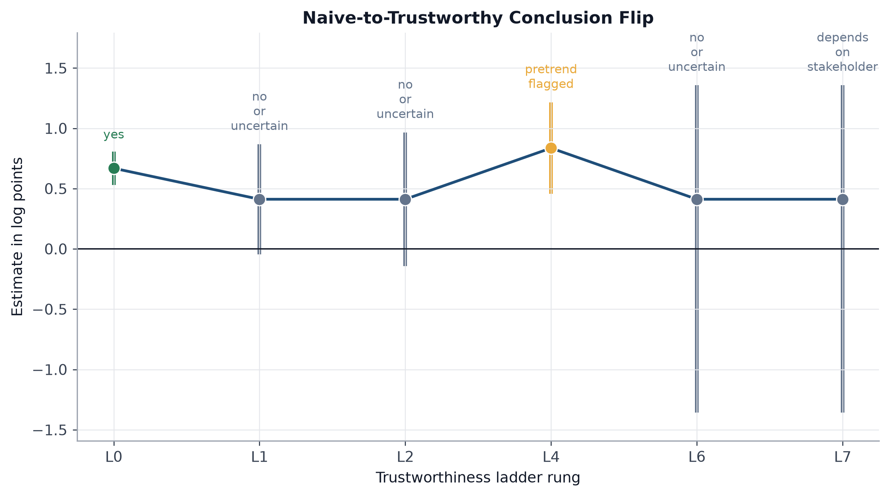
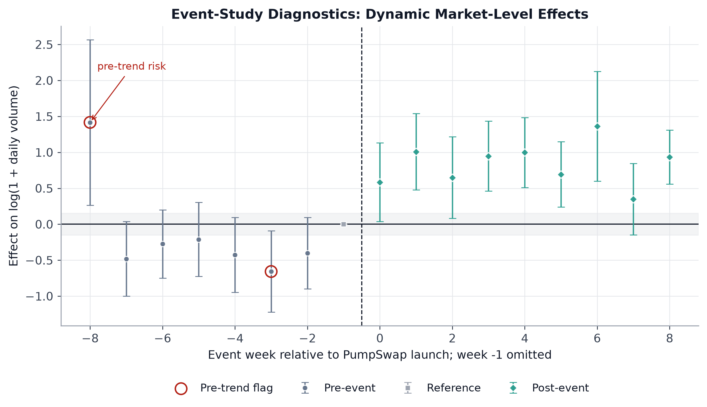
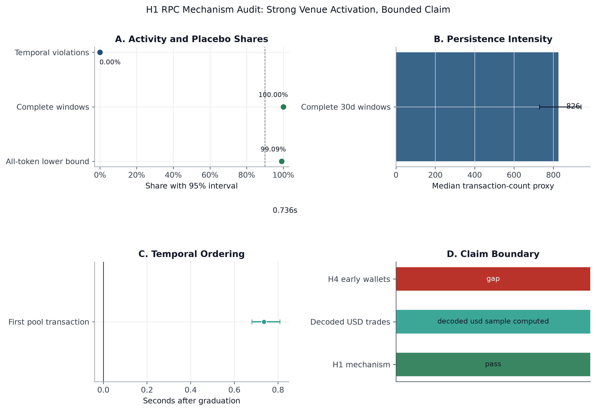
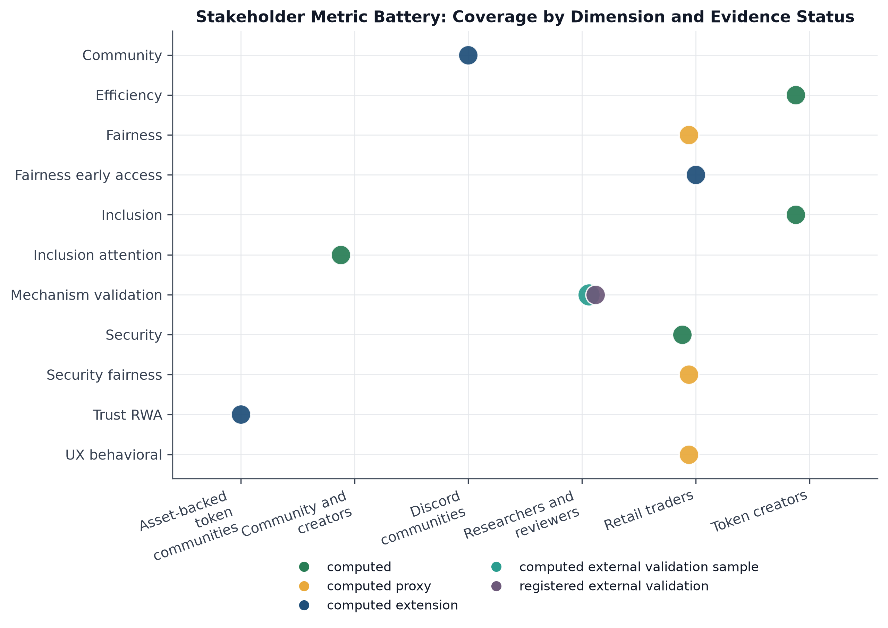

# Shilin Replication Package

## Pump.fun / PumpSwap Application Arm

This directory contains the code, data interfaces, generated artifacts, and visual diagnostics for Shilin's application arm of the paper:

*Trustworthy Causal Inference for Token Launch Platforms: An Interdisciplinary Approach of Platform Economics, Causal Econometrics, and AI Evaluation.*

The paper source remains outside this repository. This GitHub package is a replication and audit bundle: it keeps the computational evidence, but intentionally excludes paper `.tex`, `.sty`, and `.bib` files.

## Abstract

This replication package studies whether the Pump.fun to PumpSwap migration regime improved post-graduation market persistence, and whether that conclusion survives a more trustworthy causal-evaluation pipeline. The central empirical lesson is not a simple "PumpSwap worked" claim. A naive before-after dashboard says yes, but adding Solana DEX controls, two-way fixed effects, event-study diagnostics, few-cluster inference, token-level heterogeneity, and stakeholder metrics changes the conclusion to a bounded and stakeholder-dependent claim.

The package supports two paper hypotheses:

| Hypothesis | Question | Evidence in this package |
|---|---|---|
| H1 | Did lower migration friction improve post-graduation liquidity persistence? | Market-level DiD ladder, public Solana RPC validation, Moralis decoded sample, and rendered Dune SQL paths. |
| H4 | Did allocation concentration and early-wallet behavior create retail harm channels? | Holder-concentration/risk proxies, RED-COHORT sniper-cohort extension, and registered early-wallet validation SQL. |

The strongest currently supported claim is mechanism-level: PumpSwap operated as an active post-migration venue for graduated tokens. Full welfare, price-quality, active-trader, and early-wallet causal claims still require full-cohort decoded indexer outcomes. To keep the repository reviewable, this GitHub tree is a slim release package: bulky raw mirrors and page-level API dumps are intentionally excluded while their summaries, hashes, scripts, and regenerated outputs are retained.

## Research Scope

This folder owns the Pump.fun/PumpSwap application arm of the broader paper. It covers:

- empirical token-platform evidence and public-data provenance;
- H1 post-graduation persistence and mechanism validation;
- H4 holder concentration, early-access, and retail-risk proxies;
- a stakeholder metric battery for creators, retail traders, communities, reviewers, and asset-backed token contexts;
- an L0-L7 deterministic and agentic evaluation ladder.

It does not implement Claire's staggered cross-chain DiD design, except through compatible interfaces in the ladder. It also does not contain the manuscript source, manuscript tables, or paper bibliography.

## Empirical Design

The market-level design compares the Pump ecosystem with Solana DEX controls around the PumpSwap migration event date, `2025-03-20` UTC.

```text
log(1 + volume_it) = alpha_i + gamma_t + beta * Pump_i * Post_t + epsilon_it
```

where `i` indexes market units and `t` indexes days. The package treats this aggregate market DiD as one rung in a broader evaluation ladder, not as final causal proof.

| Rung | Added evidence layer | Role in the paper |
|---|---|---|
| L0 | Pump ecosystem before-after means | Operational dashboard baseline. |
| L1 | Solana DEX control group | Naive DiD comparison. |
| L2 | Unit and date fixed effects | TWFE market-level specification. |
| L3 | Dynamic event-study analogue | Timing and dynamic-response diagnostic. |
| L4 | Pre-trend screen | Identifies market-level design risk. |
| L5 | Token-level heterogeneity | H4 holder-concentration and risk proxy audit. |
| L6 | Exact wild-cluster inference | Few-cluster uncertainty correction. |
| L7 | Stakeholder metric battery | Interprets results across welfare-relevant dimensions. |

## Visual Summary

**Figure 1. Naive-to-trustworthy conclusion flip.** The benchmark starts with a positive before-after estimate and becomes uncertain once controls, diagnostics, and few-cluster inference are added.



**Figure 2. Event-study diagnostics.** The market-level event study shows positive post-event estimates but also flags pre-trend risk, so it is used as a diagnostic rather than a clean causal claim.



**Figure 3. H1 mechanism audit.** Public Solana RPC evidence supports strong post-migration venue activation, while the claim boundary blocks over-reading RPC proxies as welfare or USD-volume causality.



**Figure 4. Stakeholder metric battery.** The package reports multiple outcome dimensions rather than treating aggregate volume as the only welfare-relevant metric.



## Data Layers

The package combines public data, generated artifacts, and indexer-ready validation paths.

| Layer | Source | Main use |
|---|---|---|
| Market baseline | DeFiLlama protocol and DEX volume data | Pump ecosystem vs Solana DEX market-level DiD. |
| Token lifecycle | RED-PUMP launch and terminal-outcome data | Graduation, timeout, and token-level mechanism metrics. |
| Token metadata and risk | HuggingFace Pump.fun token datasets | Holder concentration, social metadata, and risk proxies. |
| Early-access mechanism | RED-COHORT-2026-v1 | Persistent sniper-cohort and early-wallet mechanism validation. |
| RPC validation | Pump.fun metadata plus Solana RPC / Helius-compatible outputs | Post-migration pool activation and transaction-count proxies. |
| Decoded sample | Moralis decoded swap sample | Wallet-level, USD-denominated sample outcomes for covered tokens. |
| Full indexer path | Dune SQL templates and rendered all-token queries | Registered path for full-cohort 1/7/30 day decoded outcomes. |
| Off-chain extensions | Discord sentiment, DeFiLlama TVL, RWA registry | Community and asset-backed-token comparison channels. |

Bulky raw mirrors are not committed to GitHub. The excluded files include raw Moralis swap pages, per-token Pump.fun metadata JSON, HuggingFace mirror CSVs, SolArchive parquet partitions, RED-COHORT raw ZIP/JSONL files, and raw agent responses. The package keeps compact validation outputs, rendered SQL, provenance summaries, and file-hash inventories so the evidence boundary remains auditable without turning the repository into a data dump.

## Slim Release Policy

The GitHub version keeps only files that are useful for review, reproduction, or direct paper evidence:

- analysis code, prompts, tests, and configuration;
- machine-readable result tables and audit ledgers;
- generated figures used in the README or manuscript;
- compact external-validation CSVs and rendered Dune SQL;
- public-data schemas, indexes, summary tables, and provenance ledgers.

The GitHub version excludes files that are reproducible but noisy:

- raw API/page dumps;
- per-token metadata JSON caches;
- large public-data mirrors already available from source platforms;
- raw model response JSON when `agent_runs.csv` and score tables already summarize the run;
- interrupted downloads, cache files, and local-only manuscript assets.

## Repository Layout

```text
Shilin/
  configs/                     Case configuration and event-date settings
  data_sources/                 Public data snapshots and Dune SQL templates
  prompts/                      L0-L7 agentic-evaluation prompts
  scripts/                      End-to-end, validation, RPC, Dune, and Moralis runners
  src/trustworthy_launchpads/   Reusable analysis modules
  tests/                        Artifact integrity tests
  artifacts/
    tables/                     Machine-readable result tables and audit ledgers
    figures/                    Generated figures used in the paper and README
    external_validation/        RPC, Moralis, and rendered Dune validation outputs
    agent_runs/                 Agentic-evaluation run schema and compact run summaries
```

## Reproduction

To verify the checked-in artifacts:

```bash
cd Shilin
python3 -m venv .venv
.venv/bin/python -m pip install -r requirements.txt
.venv/bin/python scripts/check_artifacts.py
.venv/bin/python -m unittest discover -s tests
```

To regenerate the package from upstream data, first edit `configs/pumpswap_case.json` so `upstream_mvp_root` points to a local full-data checkout. Raw downloads and API caches are ignored by Git by default. Then run:

```bash
cd Shilin
.venv/bin/python scripts/run_all.py
.venv/bin/python scripts/run_agentic_deepseek.py --env-file /path/to/local/.env --overwrite
.venv/bin/python scripts/run_dune_token_exports.py --max-tokens 0
.venv/bin/python scripts/run_solana_external_validation.py --max-tokens 300 --resume
.venv/bin/python scripts/download_free_public_data.py --include all
.venv/bin/python scripts/run_all.py
.venv/bin/python scripts/check_artifacts.py
```

Optional decoded-indexer execution:

```bash
export DUNE_API_KEY=...
.venv/bin/python scripts/run_dune_token_exports.py --max-tokens 1 --execute --only post_migration --performance medium
```

For larger Dune runs, use chunking and a credit cap:

```bash
.venv/bin/python scripts/run_dune_token_exports.py --max-tokens 0 --sample-strategy first --execute --only post_migration --performance medium --chunk-size 10 --max-total-credits 1700 --resume
```

If a high-throughput Solana RPC key is available, set `HELIUS_API_KEY` or `SOLANA_RPC_URL` before running `scripts/run_solana_external_validation.py`. The scripts record provider class and output provenance, not secrets.

## Main Machine-Readable Outputs

| Artifact | Path |
|---|---|
| Deterministic L0-L7 ladder | `artifacts/tables/deterministic_ladder.csv` |
| Event-study coefficients | `artifacts/tables/event_study_coefficients_shilin.csv` |
| Pre-trend diagnostics | `artifacts/tables/pretrend_diagnostics.json` |
| Few-cluster inference | `artifacts/tables/wild_cluster_bootstrap.json` |
| Stakeholder metric battery | `artifacts/tables/result1_stakeholder_metric_battery.csv` |
| Data availability ledger | `artifacts/tables/data_availability_ledger.csv` |
| Claim scope ledger | `artifacts/tables/claim_scope_ledger.csv` |
| H1 mechanism audit | `artifacts/tables/h1_rpc_mechanism_causal_audit.csv` |
| H1 mechanism summary | `artifacts/tables/h1_rpc_mechanism_summary.json` |
| Moralis decoded summary | `artifacts/tables/moralis_decoded_outcomes_summary.json` |
| Dune indexer export summary | `artifacts/tables/dune_indexer_export_summary.json` |
| Paper readiness audit | `artifacts/tables/paper_readiness_audit.csv` |
| Paper readiness summary | `artifacts/tables/paper_readiness_summary.json` |

## Current Findings

The current run produces a conclusion flip that is useful for the paper's benchmark framing:

- L0 before-after means estimate a positive Pump ecosystem change of about `0.669` log points and would conclude "yes."
- L2 TWFE estimates about `0.412` log points but has a confidence interval that includes zero.
- L4 flags pre-trend risk, so dynamic market-level estimates should be treated as diagnostics.
- L6 exact Rademacher wild-cluster inference over four protocol units widens uncertainty and remains non-significant.
- L5 finds that high-concentration tokens have a substantially higher source-coded high/critical risk rate, but this is a proxy association, not H4 causal proof.
- L7 reframes the evaluation as stakeholder-dependent rather than a single aggregate-volume verdict.

Mechanism validation is stronger than welfare causality. The RPC audit covers 1,651 graduated tokens, finds 1,636 with observed 30-day pool activity, records a 99.09% all-token observed active lower bound, and finds 100.0% active share among complete 30-day windows. Complete windows have a median transaction-count proxy of 826 and zero temporal-order violations. Moralis decoded outcomes add a covered-token sample with wallet-level and USD-valued swaps, but not a full-cohort welfare-causal estimate.

The paper-readiness audit currently labels the package `strong_replication_draft_not_submission_ready`: reproducible and useful for a workshop benchmark, but not sufficient for unconstrained welfare, price-quality, or early-wallet causal claims.

## Claim Boundary

The package supports:

- a market-level benchmark showing how naive and trustworthy pipelines diverge;
- mechanism-level evidence that PumpSwap functioned as a post-migration liquidity venue for graduated tokens;
- token-level H4 proxy evidence based on holder concentration and source-coded risk;
- a transparent data-availability ledger separating computed evidence from registered validation gaps;
- agentic-evaluation scaffolds and compact run summaries for L0-L7 conclusion reliability.

The package does not support:

- full welfare causality;
- full-cohort USD-volume, price-quality, active-trader, or trade-direction claims;
- same-cohort H4 early-wallet causal effects;
- replacing decoded indexer evidence with public-RPC signature proxies.

## Manuscript Boundary

No manuscript LaTeX files are committed in this directory. The GitHub package is intentionally limited to code, data interfaces, non-LaTeX artifacts, figures, and reproducibility checks.
