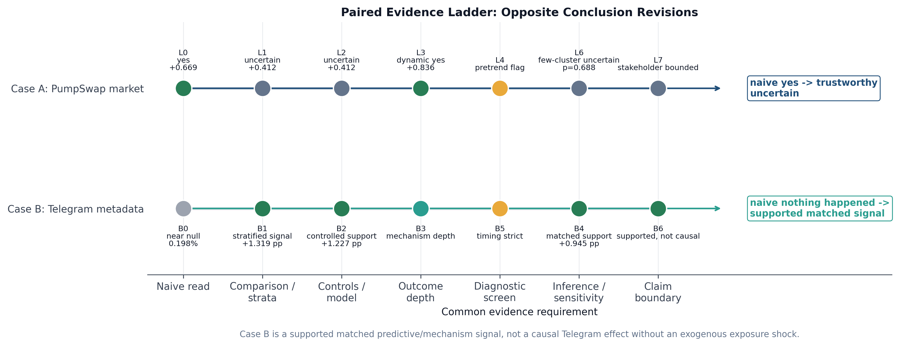

# Trustworthy Causal Inference for Token Launch Platforms

## Current Shilin Project Report

### Abstract

This report presents the current Shilin version of the Web3AI4IO application arm on Pump.fun, PumpSwap, and adjacent token-launchpad evidence. The project asks whether the Pump.fun to PumpSwap migration improved post-graduation market persistence, and whether that conclusion survives a trustworthy causal-evaluation pipeline. The central finding is deliberately bounded. A naive before-after comparison suggests a positive market response, but the conclusion becomes uncertain after adding Solana DEX controls, two-way fixed effects, event-study diagnostics, few-cluster inference, token-level heterogeneity, and stakeholder-specific metrics. The contribution of the current version is therefore not a universal claim that PumpSwap improved welfare. It is a reusable benchmark showing how evidence quality changes when platform-design claims are subjected to transparent causal, data, and AI-evaluation constraints.

### 1. Research Motivation

Permissionless token launchpads are market-design institutions. They determine who can create assets, how tokens graduate into secondary liquidity, and which risks are transferred to retail traders, creators, and communities. Pump.fun is a particularly important case because it made token creation extremely cheap and generated a very large lifecycle system. In the RED-PUMP data used here, 832,941 matched token launches produce only 1,651 graduations. This creates a central empirical tension: platform activity may rise even when durable token quality, user welfare, or post-graduation persistence remains difficult to verify.

The project therefore reframes the research question. Instead of asking only whether aggregate volume increased after the March 20, 2025 PumpSwap migration, it asks whether the positive dashboard narrative survives stronger evidence. This distinction is essential for Trustworthy AI for Good. In high-noise retail markets, an apparently positive platform metric can encourage overconfident welfare claims. A trustworthy benchmark should make unsupported, uncertain, or welfare-unidentified conclusions visible rather than treating them as failures.

### 2. Data Architecture

The current package is organized as a slim replication and audit release. It includes code, prompts, tests, machine-readable result tables, visual diagnostics, compact validation outputs, and rendered indexer paths. Bulky raw mirrors and local API caches are intentionally excluded from GitHub, while provenance summaries and artifact checks remain available.

The empirical layers are intentionally separated. DeFiLlama daily volume supports the market-level Difference-in-Differences design. RED-PUMP supplies launch, graduation, timeout, and social-metadata fields. HuggingFace Pump.fun snapshots contribute token metadata and holder-concentration proxies. Solana RPC outputs validate post-migration pool activity for graduated tokens. Moralis decoded swaps provide a covered-token sample with wallet-level and USD-valued outcomes. Dune SQL templates register the path for full-cohort decoded outcomes, but the current release does not overclaim that layer because full execution remains constrained by indexer limits.

The August revision converts this case study into a reusable benchmark release under `benchmark_release/`. Its three primary sheets are `events.csv`, `metrics_panel.csv`, and `covariates.csv`. Each row carries `event_id` and `claim_boundary` fields, allowing researchers to join event definitions, outcomes, and covariates without losing the evidentiary limit attached to each observation. Supplemental files add claim-scope ledgers, data-gap ledgers, mirror-case diagnostics, cross-chain candidates, and agentic evaluation records.

### 3. Methodology

The main methodological device is an L0-L7 evidence ladder. L0 begins with a naive Pump ecosystem before-after comparison. L1 adds Solana DEX controls. L2 adds protocol and date fixed effects. L3 estimates a dynamic event-study analogue. L4 screens for pre-trend risk. L5 moves below aggregate market volume to token-level heterogeneity and concentration-related risk proxies. L6 applies exact Rademacher wild-cluster inference because the market panel has only four protocol clusters. L7 interprets the results through stakeholder metrics rather than a single aggregate-volume verdict.

This ladder makes trustworthiness observable. The package records not only estimates, but also where the decision changes. The naive L0 estimate is strongly positive, about 0.669 log points. The L2 two-way fixed-effect estimate remains positive, about 0.412 log points, but its confidence interval includes zero. The L4 diagnostic flags pre-trend risk, and the L6 few-cluster procedure produces a wide uncertainty interval with a p-value of 0.6875. The resulting claim is therefore not "PumpSwap caused a broad welfare gain." It is that aggregate activity is directionally positive while market-level causal identification remains weak.

The project also includes an agentic evaluation arm. DeepSeek is run across L0-L7 prompts to test whether an AI research assistant updates from unsupported conclusions to bounded, stakeholder-specific claims as evidence scaffolding becomes stricter. The agent is not used as causal evidence. It is evaluated as an object of study: whether it respects estimands, uncertainty, diagnostics, and claim boundaries.

### 4. Main Findings

The strongest supported result is mechanism-level persistence. Among 1,651 graduated RED-PUMP tokens, 1,636 have observed 30-day pool activity in the RPC validation layer. This yields a 99.09 percent all-token observed active lower bound. Among complete 30-day windows, the active share is 100 percent, the median transaction-count proxy is 826, and temporal-order violations are zero. This supports the claim that PumpSwap operated as an active post-migration liquidity venue for graduated tokens.

The broader welfare interpretation remains limited. Aggregate market evidence is positive but not robust enough to establish a clean causal welfare gain. RPC activity is strong evidence of venue operation, but it is not equivalent to USD volume, trader welfare, price quality, or durable community value. The Moralis decoded sample adds useful wallet-level and USD-denominated outcomes, but it is selected toward covered and higher-activity tokens. The full-cohort Dune path is therefore a registered requirement for future stronger claims.

The stakeholder battery sharpens this boundary. It prevents the analysis from collapsing creator outcomes, trader outcomes, reviewer needs, and community welfare into one aggregate volume metric. For H4, the package finds that high-concentration tokens have a substantially higher probability of receiving a high or critical risk label. This is a proxy association, not proof of sniper causality, but it shows why higher activity can coexist with retail-risk channels.

### 5. Benchmark Extensions

The current version adds two extensions that make the project more suitable for a top-conference benchmark framing. First, it adds a mirror case based on Telegram and social metadata. A naive aggregate view sees little evidence of quality because the overall RED-PUMP graduation rate is only about 0.198 percent. Token-level stratification changes that view: Telegram-linked tokens graduate at about 1.485 percent, compared with 0.166 percent for tokens without Telegram. The matched design supports 20,227 Telegram tokens and estimates a matched ATT of about 0.945 percentage points, with a launch-day cluster bootstrap confidence interval of approximately [0.738, 1.152] percentage points and an E-value of 5.02.

This is a credible predictive and mechanism-supported signal, not a causal Telegram effect. The timing audit finds that the association appears within five minutes, while the delayed outcome after 60 minutes is zero. The public shock registry records six Telegram-related candidates, but none provides a supported in-window exogenous exposure shock. The correct interpretation is therefore claim-bounded: Case B shows that a naive near-null view can become a strong adjusted association, whereas Case A shows that a naive positive market conclusion becomes uncertain.

Second, the release adds a bounded cross-chain extension on Base through Clanker v4.1. The first observed v4.1 MEV/sniper-protection token launch is verified at `2025-08-26T20:41:57Z` in transaction `0x5c076d1967b9f4873d36191321ccf015015b48687d0f176c6ad7091a84551985`. The current bounded validation matches the first six v4.1 treated launches to nearest v4.0 controls, producing a 12-token, 36-row cohort with 1/7/30 day Uniswap v4 PoolManager outcomes and ERC20 Transfer-log holder reconstruction. A larger discovery scan covers 61,080 Clanker v4 launches and 6,940 v4.1 rows, and the full-cohort manifest specifies 13,880 matched token rows and 41,640 expected horizon rows. However, platform-wide Base causal replication still requires archive or indexer coverage for full 30-day swaps, transfers, and holder outcomes.

### 6. Academic Contribution and Limitations

The academic contribution is methodological and infrastructural. The release treats token-launchpad evaluation as an evidence-quality benchmark rather than a single empirical case. It formalizes rule-event registries, fixed-horizon token panels, off-chain covariates, claim ledgers, data-gap ledgers, and agentic evidence-behavior scoring. This connects token-platform empirics, causal econometrics, and trustworthy AI evaluation.

The main limitations are explicit. Full-cohort decoded USD and trader outcomes remain incomplete. Same-cohort early-wallet causal evidence is not yet joined to downstream outcomes. Telegram/social metadata is not causal without exogenous exposure timing. The Clanker/Base extension is accepted as event-architecture and bounded comparable-horizon evidence, not as full platform-wide replication. These limitations are not hidden; they are part of the benchmark's purpose. The current conclusion is that PumpSwap is strongly supported as an active post-migration venue, while broad welfare, price-quality, and retail-harm causal claims require additional full-cohort indexer evidence.
